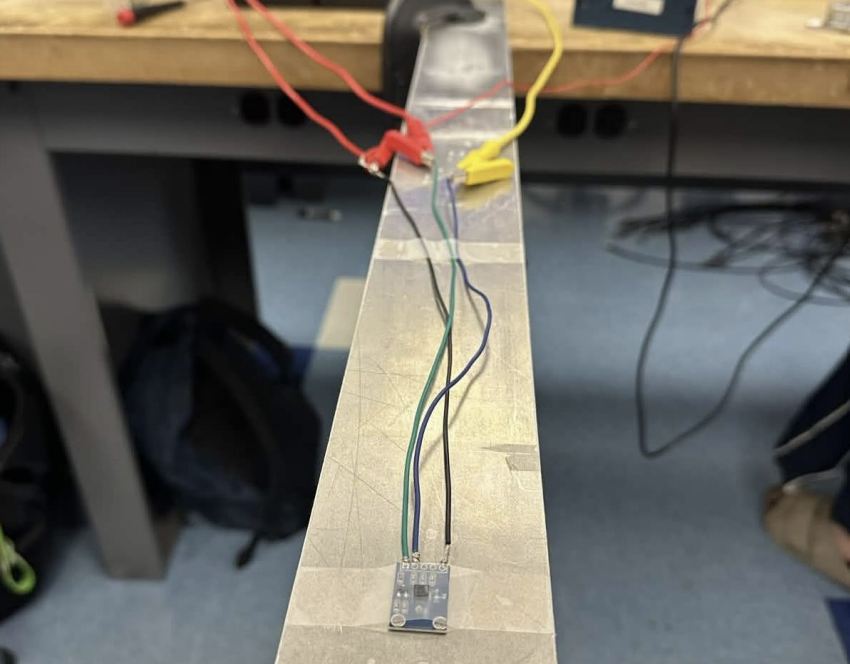

# Cantilever Beam Vibration Project

An experimental vibration analysis project investigating how added mass affects the dynamic response of a cantilever beam using an accelerometer, National Instruments DAQ hardware, and LabVIEW.

## Project Overview

The beam was excited and allowed to vibrate freely while an accelerometer measured its motion. The voltage signal was recorded in LabVIEW through an NI USB-6341 DAQ at a 1000 Hz sampling rate.

Tests were performed with **0, 1, 3, and 5 lb** of added mass. Oscillation period was estimated from consecutive waveform peaks, and frequency was calculated using `f = 1/T`.

## Key Features

- **LabVIEW Data Acquisition:** Recorded and displayed accelerometer voltage data in real time.
- **Mass-Loading Analysis:** Compared vibration response for 0–5 lb added mass.
- **Peak-Based Frequency Estimation:** Used consecutive peaks to calculate oscillation period and frequency.
- **1000 Hz Sampling:** Captured time-domain vibration data with 0.001 s resolution.

## Results

Increasing the added mass caused the beam to vibrate more slowly.

| Added Mass | Period (s) | Frequency (Hz) |
|---|---:|---:|
| 0 lb | 0.099 | 10.13 |
| 1 lb | 0.118 | 8.48 |
| 3 lb | 0.140 | 7.14 |
| 5 lb | 0.169 | 5.92 |

The measured frequency decreased from 10.13 Hz to 5.92 Hz as the added mass increased from 0 to 5 lb, consistent with the expected vibration trend.

## Technologies & Equipment

- **Software:** LabVIEW
- **DAQ:** NI USB-6341
- **Sensor:** Accelerometer
- **Sampling Rate:** 1000 Hz
- **Analysis:** Time-domain peak detection and frequency estimation

## Project Documentation

📄 [View Project Presentation](Cantilever_Beam_Vibration_Project.pdf)

The full presentation includes the experimental setup, LabVIEW VI, recorded waveforms, peak analysis, results, and discussion.
